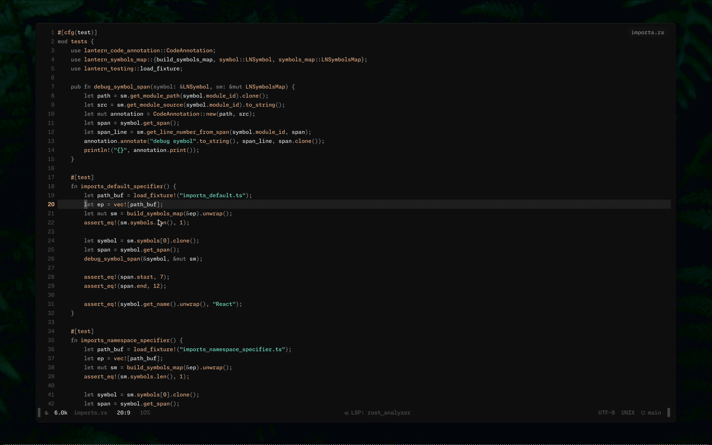
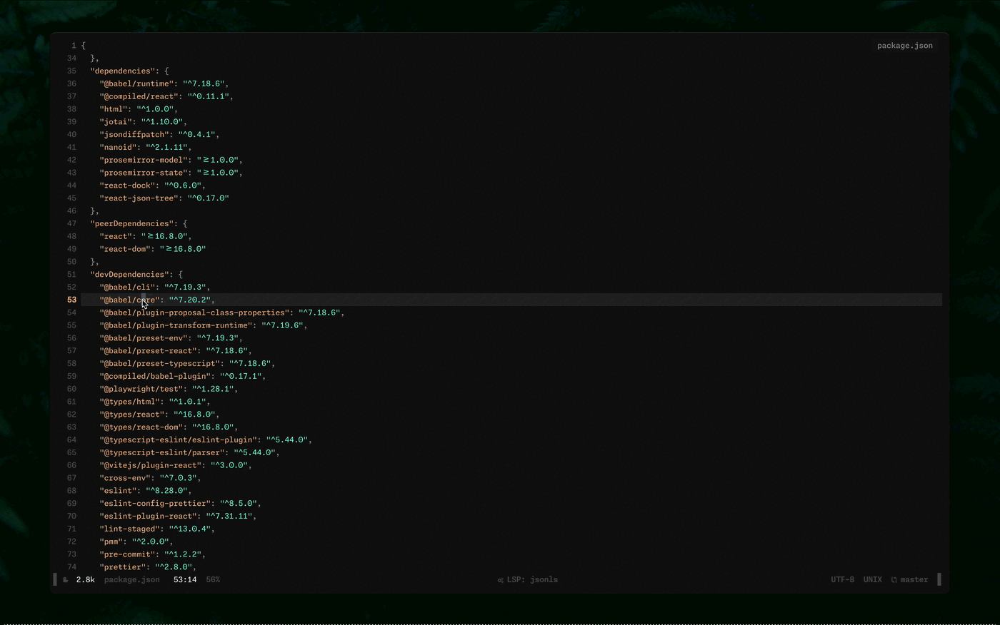

# Execa.nvim

This is a simple plugin to run shell commands in a terminal buffer with access to different "variables".

## Installation

Using [lazy.nvim](https://github.com/folke/lazy.nvim)

```lua
{
  "d4rkr00t/execa.nvim",
  cmd = "Execa",
  opts = {
    -- Open terminal in a vertical or horizontal split
    split = "vsplit",

    -- Ask for confirmation before running a command
    confirm = true,

    -- A list of pre-defined commands
    commands = {
      hello = "echo $EX_FN",
    }
  }
}
```

## Usage

### Variables

- `$EX_FN` – Current function name (powered by treesitter)
- `$EX_STR` – Content of the string under the cursor (powered by treesitter)
- `$EX_FILE_PATH_REL` – Relative path to the current file
- `$EX_FILE_PATH` – Absolute path to the current file
- `$EX_FILE_NAME_NO_EXT` – Current file name without extension
- `$EX_FILE_NAME` – Current file name with extension
- `$EX_DIR_PATH` – Current dir path
- `$EX_DIR_NAME` – Current dir name
- `$EX_LINE` – Current line number
- `$EX_COL` – Current col number

### Supported languages for treesitter based variables

- Go
- JSON
- JavaScript
- Lua
- Python
- Rust
- Typescript

> More languages can be supported by contributing treesitter queries

### Run

Runs a command in a terminal buffer.

```vim
:Execa run echo $EX_FN
```

Outputs the current function name.

### Repeat

Repeats the last command in the current context. It runs the same command but re-evaluates the variables.

```vim
:Execa repeat
```

### Command

Runs a pre-defined command in a terminal buffer.

```vim
:Execa command hello
```

### Telescope Integration

Opens a telescope picker with a list of pre-defined commands.

```vim
:Execa telescope
```

## Examples

### Run single test with cargo

```lua
:Execa run cargo test $EX_FN
```



### Get the latest version of a package from npm

```lua
:Execa run npm view $EX_STR version
```


